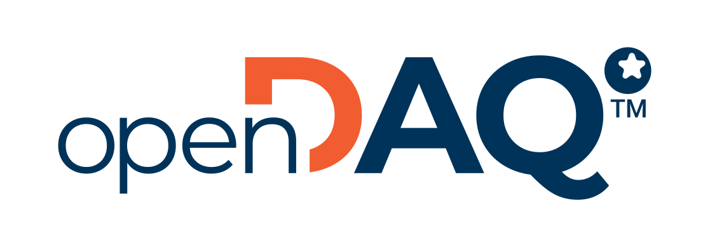

<h3 align="center">
    <a href="https://opendaq.com" target="blank_">
        
    </a>
    <br>
    SDK that bridges the gap between data acquisition devices, in an era where incompatibility is the norm
</h3>

---

openDAQ is a software development kit that allows for easy integration of data acquisition devices into its ecosystem.
It provides a simple generic API that allows users to connect to Data Acquisition (DAQ) devices that are compliant with
openDAQ and any of its supported open standards. With the SDK, users can configure properties of devices and read their
measurement data. It also contains a framework for developing custom signal processing blocks that process and analyse
signal data. In a world where DAQ devices do not readily communicate, openDAQ provides a common language for all to speak
while also embracing existing standards such as MQTT and XCP via Ethernet.

## Features

- Simple connection to openDAQ-enabled devices, allowing for property visualization/configuration and data streaming.
- Simple integration of existing data acquisition devices into the openDAQ ecosystem.
- SDK that runs the same code on both the device (server) and application (client).
- Signal processing framework that allows for implementation of custom data processing blocks that run on any SDK instance (device or application).
- OPC UA for structure/property transfer, WebSocket streaming for data.
- API built of C++ pure abstract classes that can be passed across shared library boundaries regardless of compiler and platform used.
- C++ pointer wrappers that allow for C++ features to be used in conjunction with the openDAQ pure abstract classes.
- Wrappers for Python and Delphi (C# in development).

## Getting started

- [Downloads →](https://docs.opendaq.com)
- [User documentation →](https://opendaq.github.io/)
- [API documentation (Doxgen) →](https://docs.opendaq.com/doxygen/index.html)

## Documentation

The Doxygen documentation can be built by enabling the `OPENDAQ_BUILD_DOCUMENTATION` cmake flag. The user guide
documentation can be built with Antora by following the guide found in [docs/Antora/README.md](docs/Antora/README.md).

## Building openDAQ

#### Supported compilers and platforms:

<table>
  <tr>
   <td><strong>OS</strong></td>
   <td><strong>Platform</strong></td>
   <td><strong>GCC 7.3.1+</strong></td>
   <td><strong>Clang 5+</strong></td>
   <td><strong>VC++ (v14.1+)</strong></td>
  </tr>
  <tr>
   <td rowspan="2">Windows <br>(Visual Studio)</td>
   <td>x86, x64</td>
   <td rowspan="2">/</td>
   <td>✅</td>
   <td>✅</td>
  </tr>
  <tr>
   <td>arm64</td>
   <td>⚠️🛠️</td>
   <td>⚠️🛠️</td>
  </tr>
  <tr>
   <td rowspan="1">Windows <br>(MinGW)</td>
   <td>x86, x64</td>
   <td>☑️</td>
   <td>☑️</td>
   <td rowspan="10">/
   </td>
  </tr>
  <tr>
   <td rowspan="2">Linux</td>
   <td>x86, x64</td>
   <td>✅</td>
   <td>✅</td>
  </tr>
  <tr>
   <td>armhfv7, aarch64</td>
   <td>☑️</td>
   <td>☑️</td>
  </tr>
  <tr>
   <td rowspan="2">MacOS <br>(>= 10.15)</td>
   <td>x64</td>
   <td>☑️</td>
   <td>✅</td>
  </tr>
  <tr>
   <td>arm64</td>
   <td>☑️</td>
   <td>☑️</td>
  </tr>
  <tr>
   <td>iOS</td>
   <td>arm64</td>
   <td>🛠️</td>
   <td>🛠️</td>
  </tr>
  <tr>
   <td>Android</td>
   <td>aarch64</td>
   <td>🛠️</td>
   <td>🛠️</td>
  </tr>
</table>

<table>
  <tr>
   <td>✅</td>
   <td>Actively supported (checked with CI)</td>
  </tr>
  <tr>
   <td>☑️</td>
   <td>Actively supported (no CI)</td>
  </tr>
  <tr>
   <td>⚠️</td>
   <td>Not actively supported</td>
  </tr>
  <tr>
   <td>🛠️</td>
   <td>Requires some manual changes or special configuration</td>
  </tr>
</table>

### Required tools before building

- CMake 3.24 or higher: https://cmake.org/ (might come with development environment like Visual Studio)
- Git: https://git-scm.com/
- Compiler:
  - (msvc) Visual Studio 2017 or higher with installed Workload for C++
  - (gcc windows) MSYS2: http://www.msys2.org, https://github.com/msys2/msys2/wiki/MSYS2-installation
  - (gcc) Ninja build system: https://ninja-build.org/
  - Python3: https://www.python.org/downloads/
- (optional) Boost C++ Library: https://sourceforge.net/projects/boost/files/boost-binaries/ , http://theboostcpplibraries.com
  - If installed, set CMake option `OPENDAQ_ALWAYS_FETCH_BOOST=OFF` to allow the SDK to use it.
  - See also document [BUILD.md](BUILD.md).
   
### Building on Windows

#### 1. Install all required tools / packages.

See [Required tools before building](#required-tools-before-building) above.

#### 2. Clone openDAQ repo.

```shell
git clone git@github.com:openDAQ/openDAQ.git
cd openDAQ
```

#### 3. Generate CMake project for specific compiler / preset.

In the repository root folder execute the following command to list available presets
then select the one that fits you and generate CMake project:
```shell
cmake --list-presets=all
cmake --preset "x64/msvc-22/full"
```

> ℹ️ If for any reason there is no preset for your compiler (version) you can list the "CMake generators" and
> specify one to override the closest preset (e.g. to use Visual Studio 2019):
> ```shell
> cmake -G
> cmake --preset "x64/msvc-17/full" -G "Visual Studio 16 2019"
> ```

#### 4. Build the project

Open and build `build/x64/msvc-22/full/openDAQ.sln` using Visual Studio (if one `msvc` preset had been used above).

Or use command line:
```shell
# build from repository root
cmake --build build/x64/msvc-22/full
# or move to build directory
cd build/x64/msvc-22/full
cmake --build .
```

For compilers other than `msvc`, one can add parameter `-j 4` to the build command to specify the number of parallel builds
(see _cmake.org_: [Build a Project with CMake](https://cmake.org/cmake/help/v3.24/manual/cmake.1.html#build-a-project)).

### Building on Linux

#### 1. Install all required tools / packages.

For example in Ubuntu
```shell
sudo apt-get update
sudo apt-get install -y git build-essential lld cmake ninja-build mono-complete python3
```

#### 2. Clone openDAQ repo.

```shell
git clone git@github.com:openDAQ/openDAQ.git
cd openDAQ
```

#### 3. Generate CMake project for specific compiler / preset.

In the repository root folder execute the following command to list available presets
then select the one that fits you and generate CMake project:
```shell
cmake --list-presets=all
cmake --preset "x64/gcc/full/debug"
```

#### 4. Build the project.

```shell
# build from repository root
cmake --build build/x64/gcc/full/debug
# or move to build directory
cd build/x64/gcc/full/debug
cmake --build .
```

### Additional building info

More information about advanced building options can be found in [BUILD.md](BUILD.md) document.
